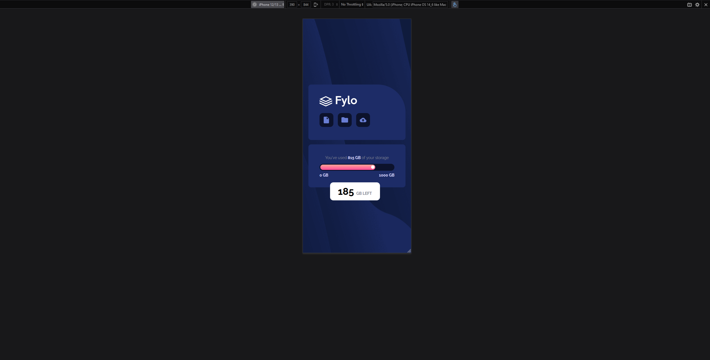

# Frontend Mentor - Fylo Data Storage Component

This is a solution to the [Fylo Data Storage Component challenge on Frontend Mentor](https://www.frontendmentor.io/challenges/fylo-data-storage-component-1dZPRbV5n). Frontend Mentor challenges help you improve your coding skills by building realistic projects.

## Table of Contents

- [What I learned](#What-I-Learned)
- [Screenshot #1](#PC-version)
- [Screenshot #2](#Mobile-version)
- [Project Link](#Project-Link)

### What-I-Learned

Funny thing I didn't expect this challenge to not having responsive input. I tried to make it and I actually did it,
but without gradient and it made me surrender this idea of responsive slider... Except that, this challenge is not really hard,
just need to have some basic knowledge and you're good to go for this practice mission!

### PC-version

### Mobile-version

### Project-Link

https://petyabiszeps.github.io/FyloDataStorageComponent/
